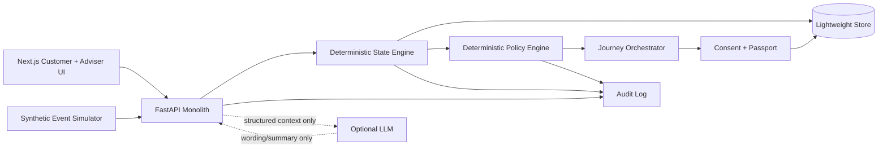

# Architecture

## Decision

Use **FastAPI** for the backend.

Why:
- state/policy logic maps cleanly to small Python modules;
- Pydantic gives fast request/response validation;
- deterministic scoring is easy to unit test;
- OpenAPI docs help frontend integration immediately;
- no need for microservices.

Node/Express would also work, but using FastAPI keeps the backend compact and explicit.

## High-level architecture

## Persistence

Start with **in-memory repository + deterministic seed JSON**. This is the fastest, safest demo architecture.

Add SQLite/Postgres only if:
- multi-process deployment requires it;
- state must survive restarts;
- the team needs a shared remote demo state.

Do not add Supabase merely because it is available.

## Module boundaries

One backend app:
- events;
- simulation;
- state-engine;
- policy-engine;
- journeys;
- consent;
- context-passport;
- audit.

## Deterministic vs generative

Deterministic:
- event normalization;
- confidence;
- evidence;
- expiry;
- state status;
- consent;
- policy;
- journey eligibility.

LLM only:
- customer-friendly explanation from structured evidence;
- adviser summary from approved passport fields;
- optional journey copy.

LLM never decides:
- state truth;
- confidence;
- consent;
- eligibility;
- credit approval;
- policy outcome.

## Real vs mocked vs proposed

| Layer | MVP status |
|---|---|
| Synthetic event simulator | Real implementation |
| State scoring | Real implementation |
| Policy evaluation | Real implementation |
| Journey state | Real implementation |
| Context Passport | Real demo object |
| KBC systems | Mocked |
| KBC APIs/CRM | Mocked |
| Production event bus | Proposed future integration |
| Production consent/security | Proposed, not claimed |
