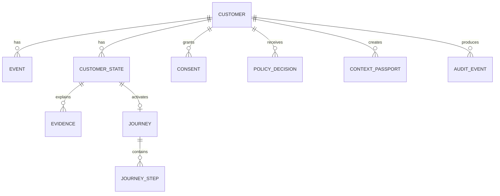

# Data Model

The MVP needs a small domain model, not a banking data warehouse.

| Entity | Key fields | Purpose |
|---|---|---|
| Customer | id, name, personaKey | demo identity |
| Event | id, customerId, type, timestamp, source, metadata | observed synthetic input |
| CustomerState | id, customerId, type, confidence, status, timestamps | temporary hypothesis |
| Evidence | id, stateId, eventIds, code, label, weight, expiry | explain score |
| Consent | id, customerId, purpose, scope, status, grantedAt, expiresAt | permission record |
| Journey | id, customerId, stateId, type, status | confirmed-goal workflow |
| JourneyStep | id, journeyId, key, title, status, order | progress |
| PolicyDecision | id, action, decision, policyCode, reason, timestamp | guardrail record |
| ContextPassport | id, customerId, purpose, fields, createdAt, expiresAt, revokedAt | scoped handoff |
| AuditEvent | id, actor, type, entityId, payload, timestamp | demo traceability |

## Relationships



## Context Passport schema

```json
{
  "id": "pass_001",
  "customerId": "elise",
  "purpose": "kbc_live_home_exploration",
  "expiresAt": "2026-10-01T18:00:00Z",
  "fields": {
    "confirmedGoal": "Explore a home purchase",
    "journeyProgress": ["understand_budget"],
    "unresolvedQuestions": ["What documents should I prepare?"]
  }
}
```

Explicitly excluded:
- raw transaction list;
- unrelated balances;
- unrelated products;
- full inference event history.

## Storage rule

For MVP, entities may be stored in memory as typed objects. Persistence technology must not change the API/domain contract.
